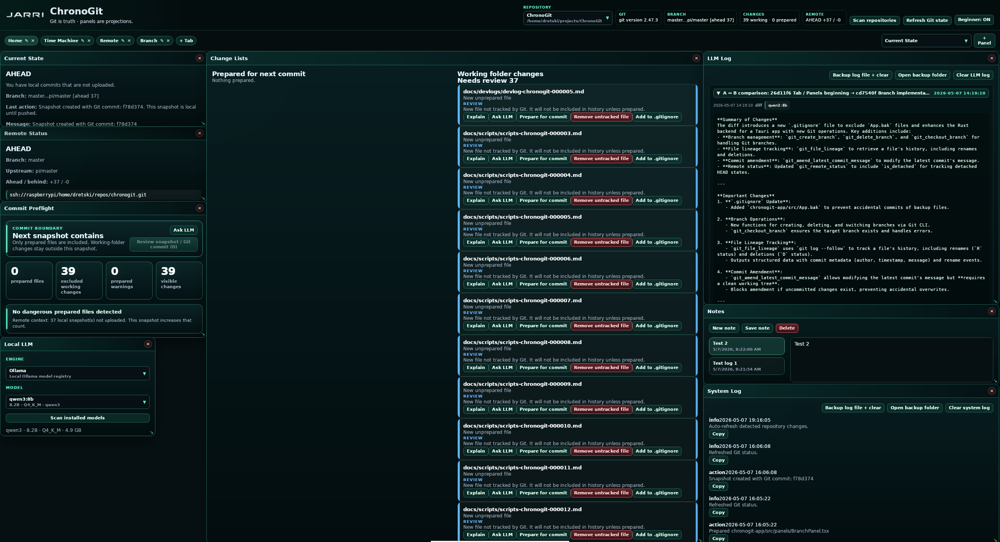
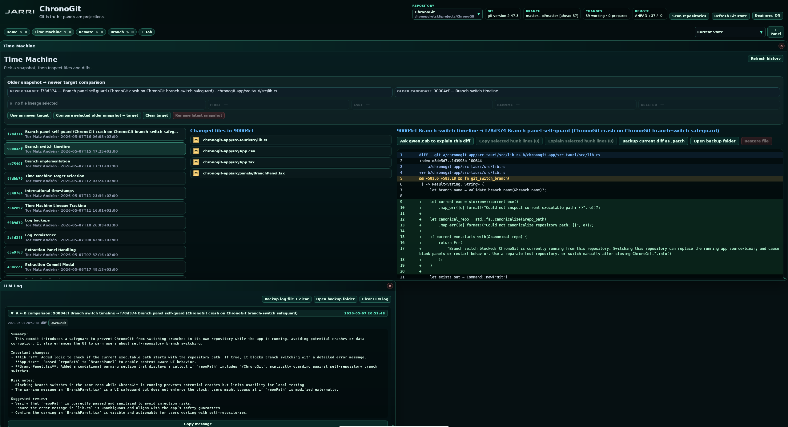

# ChronoGit

> Deterministic Git Workspace  
> Git is truth · layouts are projections



ChronoGit is a deterministic Git workspace focused on visibility, inspectability, consequence awareness, and learning.

Most Git GUIs attempt to abstract Git away.

ChronoGit attempts to expose it.

Instead of hiding repository state behind “smart” interfaces and magical workflows, ChronoGit treats Git itself as the source of truth and presents the UI as a projection of that truth.

The project began as part of the Jarri Workspace ecosystem and evolved into a standalone desktop application focused on:
- deterministic Git operations
- safety-first workflows
- educational transparency
- local-first tooling
- inspectable repository state
- visible consequences before mutation

ChronoGit is currently an early-stage but functional experimental release.

It is already usable for many repositories and workflows, but parts of the system are still evolving rapidly.

---

# Why ChronoGit Exists

Git is incredibly powerful.

Git is also notoriously opaque.

Many existing Git tools optimize for:
- speed
- abstraction
- visual polish
- hiding Git internals

ChronoGit moves in the opposite direction.

The goal is not:
> “How do we hide Git?”

The goal is:
> “How do we make Git understandable?”

ChronoGit tries to make repository state visible:
- what is local
- what is shared
- what is staged
- what is excluded
- what a commit actually contains
- what a pull/push will actually do
- what risks currently exist
- what operations mutate history
- what operations are destructive

The UI is designed around deterministic truth surfaces instead of optimistic assumptions.

---

# Core Principles

## Git Is Truth

ChronoGit never attempts to become “smarter than Git”.

Git CLI state is authoritative.

ChronoGit is a visualization, orchestration, and inspection layer around real Git state.

---

## Consequences Must Be Visible

Many Git operations are dangerous primarily because users cannot see consequences clearly.

ChronoGit attempts to expose:
- commit boundaries
- remote divergence
- merge risk
- working-tree mutation
- history rewrite implications
- destructive actions

before execution.

---

## Local-First

ChronoGit is designed around:
- local repositories
- local execution
- local reasoning
- optional local LLM integration

No cloud dependency exists.

---

## Beginner Mode Without Fake Simplification

ChronoGit contains a dual-language UI model:
- Beginner Mode
- Advanced / Git terminology mode

The behavior remains identical.

Only the explanatory surface changes.

This allows:
- learning Git gradually
- understanding state transitions
- mapping beginner concepts to real Git terminology

Example:

| Beginner Mode | Advanced Mode |
|---|---|
| Prepare for commit | git add |
| Snapshot | git commit |
| Working files | worktree |
| Prepared changes | index/staged |

---

## Deterministic Safety Philosophy

ChronoGit intentionally avoids:
- force push workflows
- hidden rebases
- automatic destructive cleanup
- silent mutation
- optimistic merge assumptions

Operations are gated through:
- previews
- confirmation layers
- risk classification
- visible consequences

---

# Current Features

## Workspace-Based Git Interface

- multi-panel workspace
- tabbed repository layouts
- inspectable Git surfaces
- modular panel architecture

---

## Time Machine



ChronoGit includes a Time Machine inspection system for:
- commit history
- file diffs
- A ↔ B commit comparison
- file lineage inspection
- patch backup
- selective diff hunk inspection
- file restoration from historical snapshots

The goal is not just “Git history”.

The goal is inspectable historical reasoning.

---

## Remote Awareness

ChronoGit continuously surfaces:
- upstream state
- ahead/behind state
- divergence
- remote URL awareness
- sync state classification

Instead of “Push succeeded”, ChronoGit tries to answer:
> “What exactly is about to happen?”

---

## Commit Preflight

Before committing:
- staged boundaries are visualized
- insertion/deletion counts are shown
- risky files are flagged
- working-tree exclusions are explained

ChronoGit tries to make commits feel like visible snapshot boundaries instead of blind save operations.

---

## Local LLM Integration (Optional)

ChronoGit supports optional local LLM integration through Ollama.

This allows:
- diff explanation
- selected hunk explanation
- UI concept explanation
- Git state interpretation

LLM output is always treated as advisory.

Git truth remains authoritative.

---

## System Log + LLM Log

ChronoGit maintains:
- deterministic system events
- separate LLM advisory logs
- backup/export support

This separation is intentional.

The system distinguishes:
- machine truth
- advisory interpretation

---

# Current Project Status

ChronoGit is currently:
- experimental
- rapidly evolving
- partially hardened
- actively refactored

It is not yet considered production-safe for critical repositories.

Areas still under active validation:
- branch switching workflows
- merge/rebase edge cases
- larger repository testing
- multi-platform packaging
- extensive Windows validation

Current recommendation:
- use ChronoGit on personal/test repositories first
- understand Git fundamentals before trusting any GUI completely
- verify important operations manually

---

# Architecture Overview

## Frontend

- React
- TypeScript
- Vite

---

## Desktop Runtime

- Tauri
- Rust backend

---

## Git Layer

ChronoGit uses real Git CLI operations as the canonical truth source.

The application does not implement its own fake Git engine.

---

## Philosophy Layer

ChronoGit is heavily influenced by:
- deterministic infrastructure thinking
- inspectable systems
- auditability
- visible state transitions
- “truth surface” architecture

---

# Current Limitations

ChronoGit is not yet:
- a polished commercial Git client
- a complete GitKraken replacement
- a beginner-proof Git abstraction
- fully hardened against every edge case

Some workflows remain intentionally conservative.

The project currently prioritizes:
- correctness
- inspectability
- architecture
- educational visibility

over:
- automation
- polish
- aggressive feature scope

---

# Roadmap Direction

Planned or explored directions include:
- stronger branch graph visualization
- commit relationship graphs
- deterministic merge simulation
- richer diff cognition
- workspace persistence improvements
- better Windows packaging
- repository health analysis
- operation audit trails
- safer branch mutation tooling
- Chrono-Field-inspired visual repository projection
- stronger patch lineage reasoning
- advanced local AI reasoning layers

---

# Build Instructions

## Requirements

- Node.js
- Rust
- Cargo
- Tauri prerequisites
- Git
- Optional: Ollama

---

## Frontend

```bash
cd chronogit-app
npm install
npm run tauri dev
```

---

## Production Build

```bash
npm run tauri build
```

---

# Repository Structure

```text
chronogit-app/
├── src/
│   ├── panels/
│   ├── components/
│   ├── shell/
│   ├── tabs/
│   ├── workspace/
│   └── core/
│
├── src-tauri/
│   ├── src/
│   └── capabilities/
│
docs/
├── devlogs/
├── docs/
└── scripts/
```

---

# Documentation Philosophy

ChronoGit is developed with heavy, Jarri compliant, internal documentation.

The repository contains:
- canonical devlogs
- architectural writeups
- script documentation
- subsystem explanations

The project treats documentation as part of the system itself rather than external decoration.

---

# Project Doctrine

ChronoGit development follows a strict workflow doctrine:

> Investigate → Implement → Verify → Challenge → Document

The project intentionally avoids:
- blind patching
- hidden mutation
- architecture guessing
- silent behavior

---

# Final Notes

ChronoGit is still early.

But the core direction is already clear:

- Git should become inspectable
- repository state should become visible
- consequences should become understandable
- local tooling should remain sovereign
- learning Git should not require suffering through invisible state

ChronoGit is an attempt to make Git visible instead of magical.

---

# License

ChronoGit is released under the MIT License.

This project is intended to be:
- inspectable
- modifiable
- educational
- hackable
- locally sovereign

Commercial use, redistribution, modification, and private forks are permitted under the terms of the MIT License.

See the LICENSE file for full license text.


If you build on ChronoGit, visible credit to the original project and author is appreciated.

ChronoGit was created by Tor Matz Andrén as part of the broader deterministic systems philosophy behind Jarri.
http://jarri.systems
http://www.gbsproductions.se

